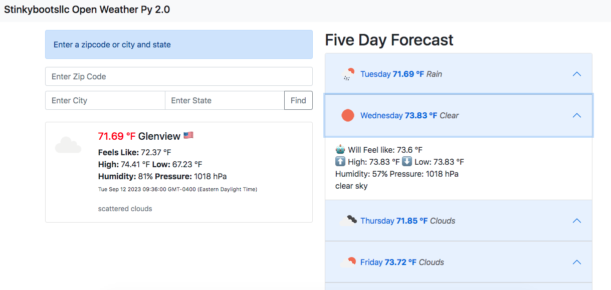

# Open-Weather-Py

Created for educational purposes only. I wanted to create a web app using the python flask framework.  I needed the application to be simple and cover the basics of using flask.  I created the original vers 1, to replace a html widget for a work project. It was a prototype and never implemented (I got a job somewhere else). I am currently in a dept. wide python training program (self pased) and working on seperate python projects not related to web technologies. This one was just for me and just for fun. This is a minimum viable application (very basic)

## Features

1. Search by U.S. zipcode. or U.S. city name and state
2. Displays current weather
3. Displays five day weather forcast

## Dependencies

* Python 3.6.8
* Python Flask
* [openweathermap](https://openweathermap.org/) API key

## Installing

* Download or clone this repository
  * `git clone https://github.com/stinkyBootsLLC/weather.git`

## Getting Started

* Run the application script `python app.py`
* Navigate to `http://127.0.0.1:5000` with a web browser

07052024
NOTE TO SELF- I HAVE A VIRTUAL ENV SET UP IN HERE `.venv`
TO ACTIVATE `source .venv/bin/activate`

# Lessons Learned

This specific app would have been easier to create with just a javascript framework such as Node, Vue, etc...  It simply calls a rest API and renders the HTML.  So why did I use python? To learn. State is not included in the JSON response. I have a free account, so it is limited. Seems like _"open weather"_ is click bait.

## Version History

* 2.0
    * Python Version
    * Search - User input 
    * Python Version
    * Current weather
    * Five day forecast

* 1.0
    * Vanilla JavaScript
    * Single current weather widget for Tobyhanna PA only

## License

This project is licensed under the [CC0 1.0 Universal (CC0 1.0)](https://creativecommons.org/publicdomain/zero/1.0/legalcode) 

## Acknowledgments

* [@datagy](https://youtu.be/JCD7YdOSsWI?si=8E_8CIXMRshxY1CK) Build YOUR OWN Weather App in Python with Flask (COMPLETE Beginner Tutorial)
* [Flask](https://flask.palletsprojects.com/en/2.3.x/) Documentation